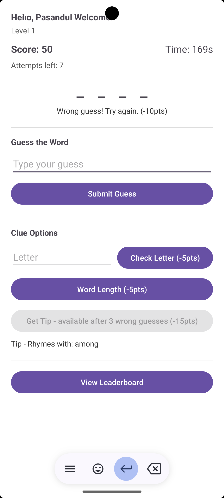

>>> Word Guessing Game — Android App   <<<

An Android word guessing game built with Java in Android Studio.

>> Features

- Random word fetched live from a REST API each round
- Real time scoring system (starts at 100, -10 per wrong guess)
- Letter frequency checker (-5pts)
- Word length hint (-5pts)
- Rhyme based tip system via API Ninjas (-15pts, unlocks after 3 wrong guesses)
- Live timer tracking how long each guess takes
- Persistent player name using SharedPreferences
- Need to fix the leaderboard

>> Tech Stack

- Java -  Main programming language 
- Android Studio - Development environment 
- Volley - HTTP networking library 
- SharedPreferences - Persistent local storage 
- REST APIs - Word fetching, rhymes

>> APIs Used

- random word-api.herokuapp.com  for Fetching random secret word 
- api-ninjas.com for Getting rhyming word for tip 

>> Screenshots

  
  

>> Game Rules
- Player starts with 100 points
- Each wrong guess costs 10 points
- Checking a letter costs 5 points
- Checking word length costs 5 points
- Getting a tip costs 15 points (available after 3 wrong guesses)
- Guess correctly to advance to next level with longer words
- Run out of attempts or points — game resets

>> Screenshots

